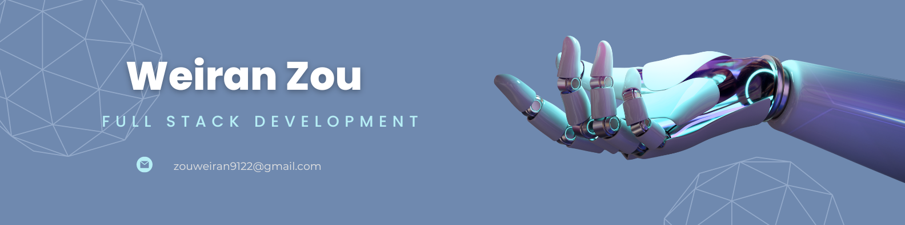

<h1 align="center">Hi 👋, I'm Weiran (Peter) Zou</h1>
<h3 align="center">An enthusiastic IT graduate with full-stack and Android app development skills.</h3>

- 🔭 I’m currently working on **My Portfolio Website**

- 🌱 I’m currently learning **AWS**

- 💬 Ask me about **react, Java, JavaScript, express.js**

- 📫 How to reach me **zouweiran9122@gmail.com**
  
- 📖 Education:
  1. 🧑‍🎓 Master of Information Technology   -> University of Melbourne
  2. 🧑‍🎓 Bachelor of Information Technology -> Queensland University of Technology
  

<h3 align="left">Connect with me:</h3>

<h3 align="left">Languages and Tools:</h3>

                     

